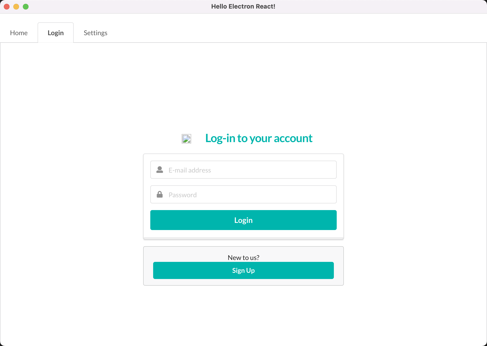
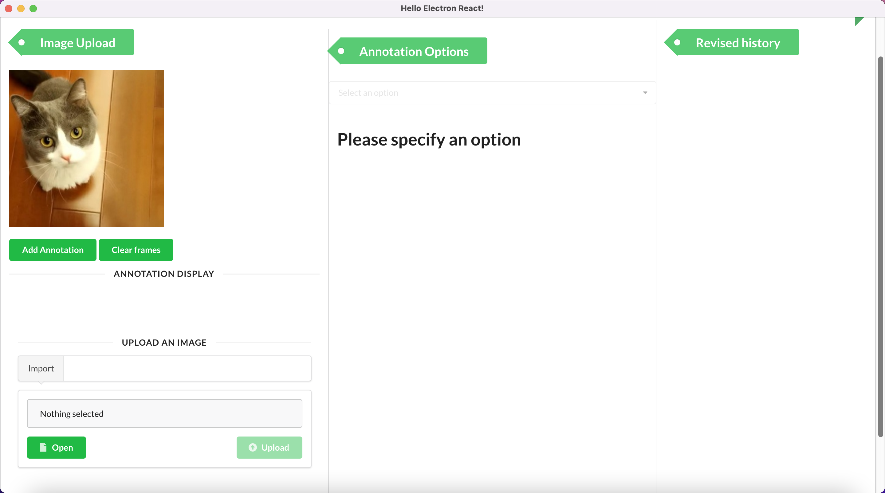
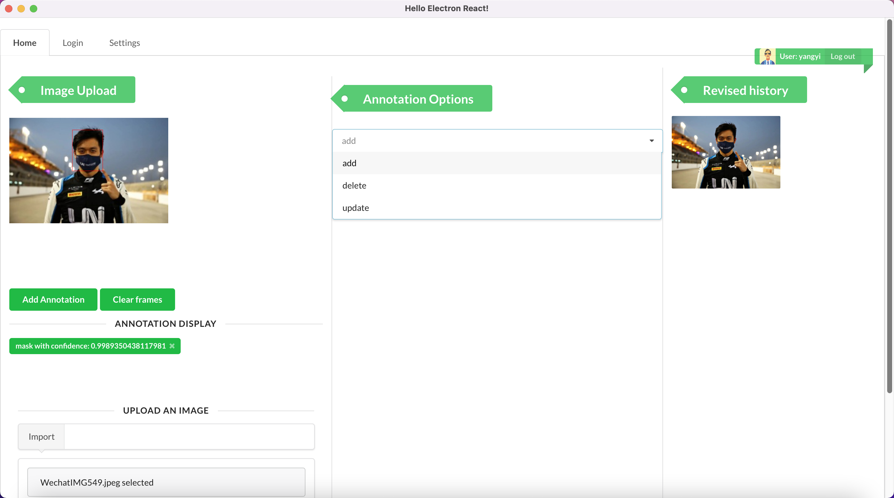

# E6893-final-project: Automatic Image Labelling System
Final Project of ELEN6893@Columbia University: Automatic Image Labelling System
- author: [Yi Yang](https://github.com/yaannnik), [Jiashu Chen](https://github.com/Jiashu0326), [Jing Peng](https://github.com/paterlisia)

## Installation

### Requirements

- **Linux or macOS with Python ≥ 3.6**
- **[PyTorch](https://pytorch.org/) ≥ 1.8 and [torchvision](https://github.com/pytorch/vision/) that matches the PyTorch installation**
- **OpenCV is strongly recommended**
- **a [node](https://nodejs.org/en/) version ≥ 7 and an [npm](https://www.npmjs.com/) version ≥ 4**
- **If you have installation or compilation issues with this project, please see [electron's official debugging guide](https://github.com/chentsulin/electron-react-boilerplate/issues/400)**

Install dependencies with yarn.

```bash
$ cd your-project-name
$ npm install
```


* We have made our project running on our Google Cloud Server. If you would like to run our project on your own environment, please follow the installation instructions.


### Build Detectron2

Our deep learning engine is based on [Detectron2](https://github.com/facebookresearch/detectron2). Run [install.sh](install.sh) to install Detectron2. Set environmental variable `$DETECTRON2_DATASETS` to be path to your dataset.


## Getting Started

### Train your model

If it is the first time you use our automatic labelling system, you will need to train a basic model to make it work for you. Make sure your dataset is in COCO format. You can use [labelme_to_coco.py](auto-annotation-server/detectron2/tools/datasets/labelme_to_coco.py) to transform your labelme dataset into a COCO dataset.

Run [train.sh](train.sh) to start training process. Feel free to change the network according to your requirements.

*If you would like to train your model using your own dataset with your designed categories, you will need to change the COCO_CATEGORIES in [builtin_meta.py](auto-annotation-server/detectron2/detectron2/data/datasets/builtin_meta.py)


### Start front-end and back-end of our app

Use [start-frontend.sh](start-frontend.sh) and [start-backend.sh](start-backend.sh) to start the front-end and back-end of our app.


### Sign up/Login

To use your unique model and settings, sign up/login with your account first.




### Settings

Upload your customized config file and model to label your data via our settings panel.


### Label your image

After login and upload your model and config file, you can now use our system to label your images. Click on 'Open' to select your image and then click on 'Upload' to send your image to our backend.




### Make your modifications

You can make modifications including adding, updating or removing annotations to your label results. Operations in the Display panel and Option are both supported.




## Update your model

If you wold like to update your model to improve model's performance, [Airflow](https://airflow.apache.org/) is needed to support periodically training. Details of our periodically training can be found in [airflow-utils](./airflow-utils). Put all the files into your `$AIRFLOW_HOME/dags`.


## Acknowledgement

This work is the final project for EECS-E6893@Columbia University.